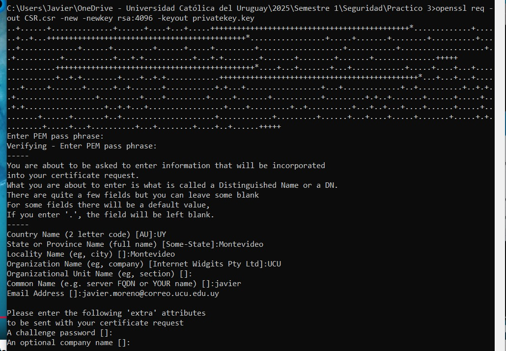

# Práctico 3: PKI

## Capitaulo 1: Generación de llaves y certificado

El primer paso es crear un par de claves criptográficas (una clave pública y una clave privada) que serán utilizadas para firmar digitalmente los documentos.

En este caso, se utilizó un tamaño de clave de 4096 bits, lo que proporciona un alto nivel de seguridad para proteger información.

Para generar las llaves se utilizó la herramienta openssl con el siguiente comando:

`openssl req -out CSR.csr -new -newkey rsa:4096 -keyout privatekey.key`

Este comando realiza las siguientes acciones:

* Genera un nuevo par de llaves con el algorito RSA de 4096 bits.
* Guarda la clave privada en el archivo privatekey.key.
* Crea una solicitud de firma de certificado en el archivo CSR.csr, que contiene la clave pública y los datos de la entidad (nombre, organización, país, etc.) necesarios para solicitar un certificado digital.

El siguiente paso es obtener un certificado digital firmado por una Entidad Certificadora (CA). Este certificado asocia la identidad del solicitante con su clave pública.

La solicitud se realiza mediante el archivo CSR (Certificate Signing Request) generado en el paso anterior. La Entidad Certificadora verifica la identidad del solicitante y emite un certificado digital firmado.

Con este certificado, se procede a firmar el contrato... blablabla... continuar

